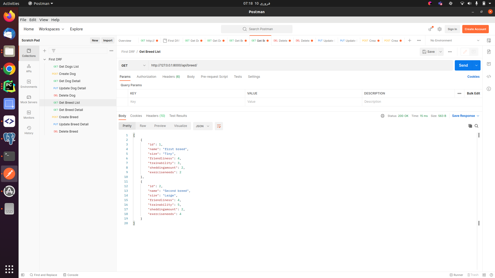
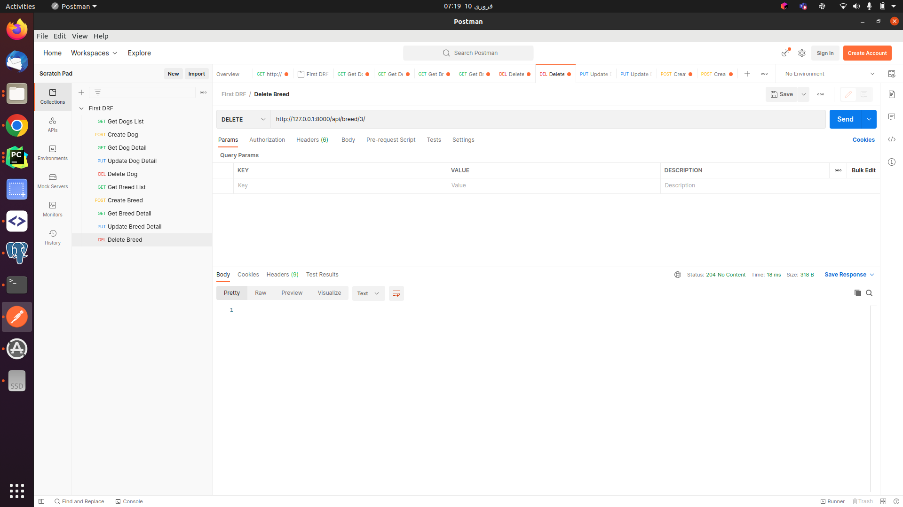
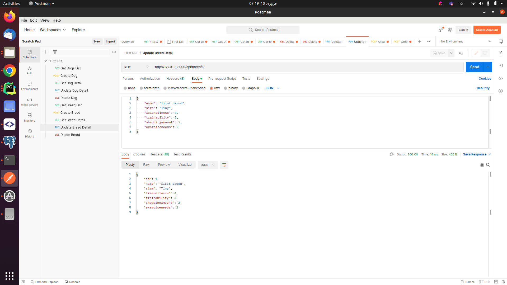
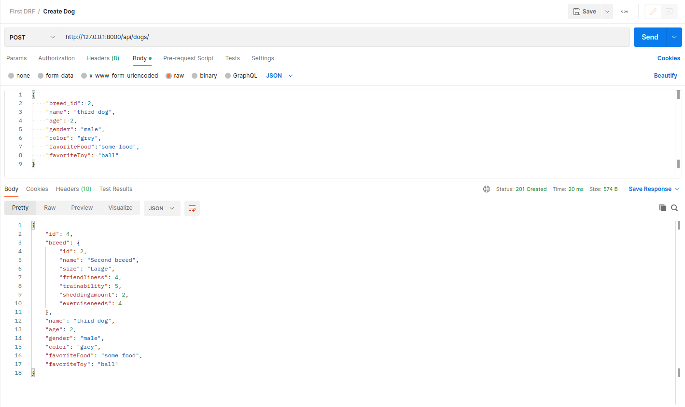
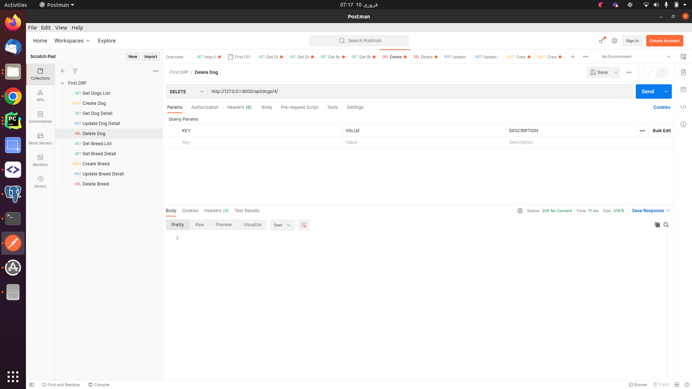

# DRF

This project was created with Django Rest Framework.

## Available Scripts
In the project directory, you can run:

### `pip install -r requirements.txt`

For connecting to Database, edit the .env file inside the DRF folder. 
Add Database name, password, port and host to connect to the Database. 

Then run the following commands to make and apply migrations:

### `python manage.py makemigrations `
### `python manage.py migrate `

Then run the following command to start the project:

### `python manage.py runserver `

Runs the app in the development mode.

It can be tested at http://localhost:8000 in postman.

Following are the snippets of test performed

## Breed List

Method: GET

URL: http://127.0.0.1:8000/api/breed/

## Breed Details

Method: GET

URL: http://127.0.0.1:8000/api/breed/1/

## Create Breed

Method: POST

URL: http://127.0.0.1:8000/api/breed/

## Delete Breed

Method: DELETE

URL: http://127.0.0.1:8000/api/breed/2/

## Update Breed

Method: PUT

URL: http://127.0.0.1:8000/api/breed/1/

# Dog List

Method: GET

URL: http://127.0.0.1:8000/api/dogs/

# Dog Details

Method: GET

URL: http://127.0.0.1:8000/api/dogs/1/

# Create Dog

Method: POST

URL: http://127.0.0.1:8000/api/dogs/

# Delete Dog

Method: DELETE

URL: http://127.0.0.1:8000/api/dogs/2/

# Update Dog

Method: PUT

URL: http://127.0.0.1:8000/api/dogs/1/

